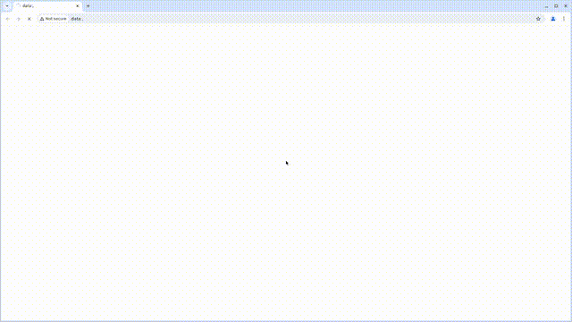
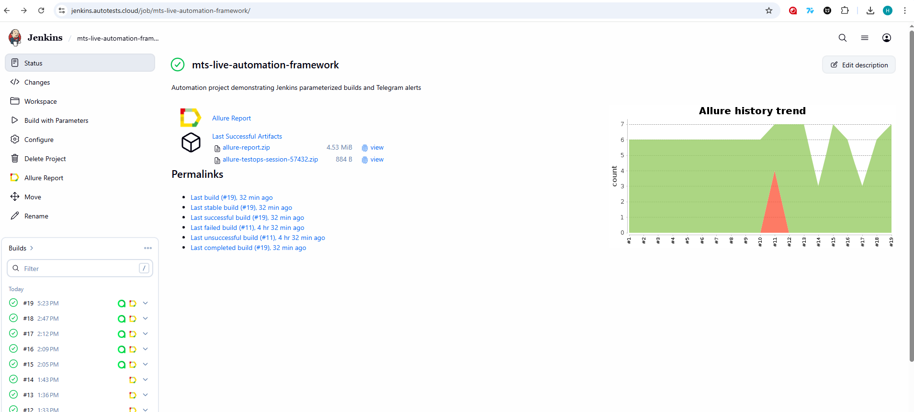
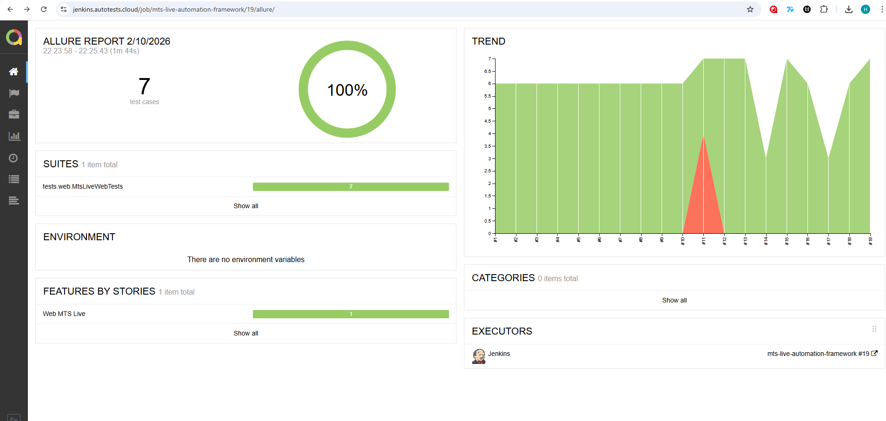
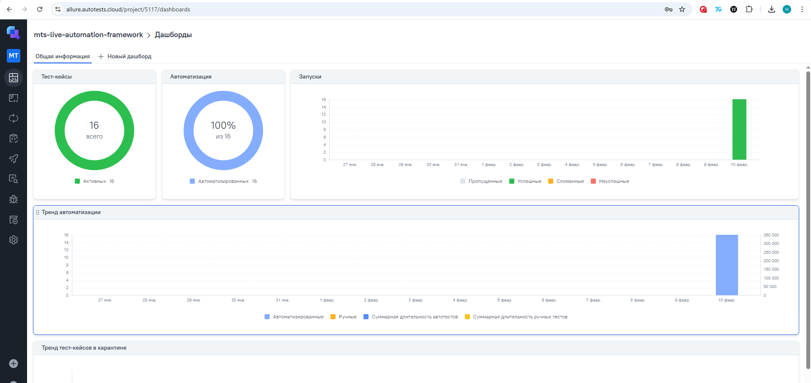
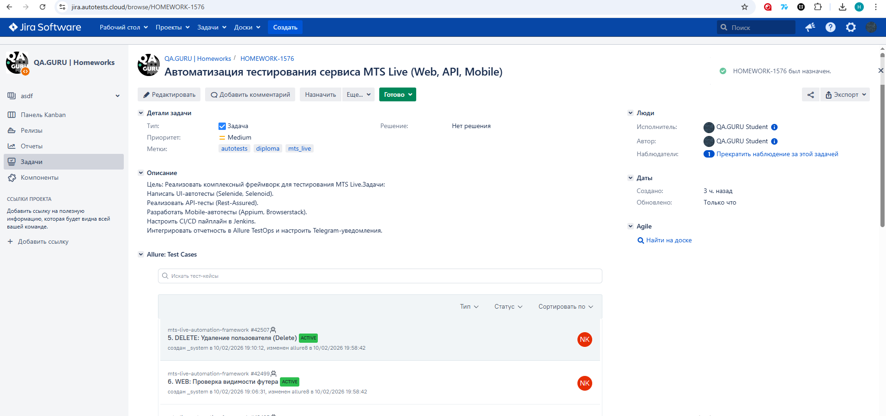
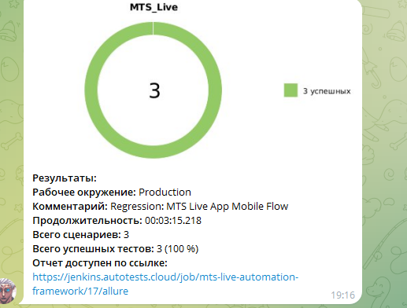

# 🎓 Дипломный проект  
# Комплексная система автоматизированного тестирования сервиса **MTS Live**

<p align="center">
  
</p>

**MTS Live** — это сервис продажи билетов и управления мероприятиями, предоставляющий пользователям удобный интерфейс для выбора событий, покупки билетов и отслеживания активности.

---

## 📌 Описание проекта

Данный проект разработан в рамках дипломной работы и представляет собой **комплексную систему автоматизированного тестирования** сервиса продажи билетов и мероприятий **MTS Live**.

Система охватывает несколько уровней тестирования:

- 🌐 **WEB UI тестирование** пользовательских сценариев  
- 🔌 **API тестирование** серверной логики  
- 📱 **Mobile тестирование** мобильного приложения  

Проект демонстрирует построение масштабируемого тестового фреймворка, организацию тестовой архитектуры и интеграцию с современными инструментами CI/CD и отчетности.

---

## 🎯 Цель и задачи проекта

### Цель
Разработка и реализация единого фреймворка автоматизированного тестирования для различных уровней приложения MTS Live.

### Задачи
- Реализовать UI-автотесты с использованием паттерна **Page Object**
- Разработать API-автотесты с моделями данных и спецификациями
- Настроить Mobile-автотесты с локальным и удалённым запуском
- Реализовать интеграции с Jenkins, Allure, Allure TestOps и Jira
- Настроить систему уведомлений о результатах тестирования
- Создать документацию для ручного тестирования

---

## 🛠 Технологический стек

<p align="center">


 
</p>

---

# 🌐 UI АВТОТЕСТЫ

UI-тесты покрывают ключевые пользовательские сценарии сайта **MTS Live**. Все тесты реализованы в классе `MtsLiveWebTests` и построены с использованием паттерна **Page Object**.  

### Реализованные сценарии
- **Поиск мероприятия по названию**  
  Проверка корректности результатов поиска по ключевому слову.

- **Смена города на Санкт-Петербург**  
  Проверка правильного отображения текущего города после смены.

- **Поиск несуществующего события**  
  Проверка корректного поведения при отсутствии результатов поиска.

- **Переход в раздел "Шоу" через хедер**  
  Проверка навигации по основным категориям сайта.

- **Фильтрация мероприятий по датам**  
  Проверка корректного применения фильтра по диапазону дат.

- **Проверка видимости футера**  
  Убедиться, что футер сайта отображается на всех страницах.

- **Проверка переключения баннеров в слайдере**  
  Проверка работы слайдера и переключения баннеров.

---

### 🌐 Архитектура UI-тестов

UI-тесты построены с использованием паттерна **Page Object** и запускаются через **Selenoid**:

- ✔ Все тесты наследуются от `BaseTest`
- ✔ Конфигурация передается через **System Properties**
- ✔ Для удалённого запуска параметры (браузер, версия, размер окна) берутся из **Jenkins**
- ✔ Используются аннотации Allure: `@Epic`, `@Feature`, `@Story`, `@Severity`, `@Owner`, `@DisplayName`
- ✔ Шаги логируются через `@Step` и `step()`
- ✔ Добавляются вложения в Allure: скриншоты, HTML страницы, логи браузера, видео прохождения теста
  

### `WebTestBase` содержит
- Настройку:
  - `Configuration.baseUrl`  
  - `Configuration.browser`  
  - `Configuration.browserVersion`  
  - `Configuration.browserSize`  
  - `Configuration.remote`  
- Добавление вложений в Allure:
  - Скриншоты  
  - HTML страницы  
  - Логи браузера  
  - Видео прохождения теста  
- Закрытие браузера после каждого теста

### PageObject слой
- Элементы не объявляются как `static`  
- Методы принимают параметры (нет хардкода данных)  
- Вся логика работы со страницей скрыта внутри PageObject

---

# 🔌 API АВТОТЕСТЫ

API-тесты реализованы с использованием **Rest Assured**.

⚠️ Публичное API сервиса MTS Live защищено механизмами Cloudflare и другими средствами защиты от автоматизированных запросов.  
В связи с этим для демонстрации архитектуры API-автотестов использовался учебный сервис **Reqres.in**.

### Реализовано

✔ Тесты на методы:
- GET  
- POST  
- PUT/PATCH  
- DELETE  

✔ Используются **DTO модели** для:
- формирования request body  
- десериализации response body  

✔ Настроены **Request и Response спецификации**  

✔ Подключен **Allure Rest-Assured Filter** с кастомными шаблонами  

✔ Базовый URI задается через:

- RestAssured.baseURI

✔ Проверки в тестах включают:
- Статус код ответа  
- Значения полей в response body  
- Десериализацию ответа в модель  

---

# 📱 MOBILE АВТОТЕСТЫ

Mobile-тесты направлены на проверку мобильного приложения сервиса **MTS Live**.

### Особенности

- ✔ Конфигурация запуска осуществляется через **Jenkins и Owner**:
  - локальный запуск на эмуляторе  
  - удаленный запуск на BrowserStack  
- ✔ Параметры для удаленного запуска (логин, пароль) берутся **из защищённых Jenkins-переменных**, а не хранятся в коде  
- ✔ `BaseMobileTest` содержит:
  - настройку запуска Appium  
  - добавление вложений в Allure (скриншоты, логи, видео)  
  - закрытие сессии после теста  
- ✔ Шаги тестов логируются в Allure  

### 📱 Тестируемое мобильное приложение

Мобильное приложение не размещено в репозитории из-за большого размера установочного файла.  

🔗 **Ссылка для скачивания APK:**  
(https://disk.yandex.ru/d/ICc1tND7Ax7Lvg)

После загрузки приложение может быть использовано для локального запуска тестов на эмуляторе или устройстве.


---

###  Видео примера запуска тестов в Selenoid

В отчётах Allure для каждого теста прикреплён не только скриншот, но и видео прохождения теста:

<p align="center">
  
</p>

###  Видео примера запуска мобильных тестов

<p align="center">
  
</p>


# ⚙️ CI/CD и ИНТЕГРАЦИИ

## 🛠 Jenkins

[Ссылка на сборку в Jenkins](https://jenkins.autotests.cloud/job/mts-live-automation-framework/)

Для запуска сборки необходимо перейти в раздел <code>Собрать с параметрами</code>, выбрать значение для таких параметров как: COMMENT, TASK, browser, browserVersion, browserSize. Далее нажать кнопку <code>Собрать</code>.
<p align="center">

</p>
После выполнения сборки, в блоке <code>История сборок</code> напротив номера сборки появятся значки <code>Allure Report</code> и <code>Allure TestOps</code>, при клике на которые откроется страница с сформированным html-отчетом и тестовой документацией соответственно.

---

## 📊 Allure Report

[Ссылка на Allure отчёт](https://jenkins.autotests.cloud/job/mts-live-automation-framework/19/allure/)



Отчет содержит:

- Шаги тестов  
- Скриншоты  
- Логи браузера  
- Видео прохождения тестов  

---

## 🧪 Allure TestOps

[Ссылка на проект в Allure TestOps](https://allure.autotests.cloud/project/5117/dashboards)

На *Dashboard* в <code>Allure TestOps</code> видна статистика по тестам: автоматизированных тестов, результаты прогона при каждом запуске сборки.



## Результат выполнения автотеста


---

## 🐞 Интеграция с Jira

[Ссылка на задачу в Jira](https://jira.autotests.cloud/browse/HOMEWORK-1576)



Тест-кейсы связаны с задачами, результаты прогонов отображаются в задачах.

---

## 📩 Уведомления в Telegram



После завершения сборки бот отправляет уведомление с результатами тестирования.

---

# ▶️ Запуск тестов

### 💻 Локальный запуск (WEB)
Используйте эту команду для прогона тестов в локальном браузере:
```bash 
./gradlew clean test -Dbrowser=chrome -DbrowserSize=1920x1080 -DbrowserVersion="" --tests "tests.web.MtsLiveWebTests"
```

### 🛠 Настройка параметров для запуска WEB-тестов в Jenkins:

Для корректного прогона UI-тестов в интерфейсе Jenkins выберите следующие значения:

1.  **TASK**: установите значение `web` (это запустит тесты из пакета `tests.web`).
2.  **browser**: выберите браузер — `chrome` или `firefox`.
3.  **browserVersion**:
    *   Для **chrome** выберите: `127.0` или `128.0`.
    *   Для **firefox** выберите: `124.0` или `125.0`.
4.  **browserSize**: установите разрешение `1920x1080` (рекомендуется для стабильности элементов).
5.  **remoteUrl**: адрес Selenoid подставится автоматически.

После выбора параметров нажмите кнопку **Build**.

### API тесты
Используйте эту команду для прогона тестов в локальном браузере:
```bash 
./gradlew clean test --tests tests.api.*
```
### ⚙️ Настройка параметров API-тестов в Jenkins

Для прогона API тестов выберите следующее значение:

- `TASK` — установите значение `api` (для запуска тестов из пакета `tests.api`).
  
После выбора параметров нажмите кнопку **Build**.

### 📱 Запуск мобильных тестов (Android)

Для запуска мобильных тестов на локальном эмуляторе (когда запущен AppiumServer, эмулятор и скачан apk), используй эту команду::
```bash
./gradlew clean test --tests tests.mobile.MtsLiveMobileTests -DdeviceHost=emulation
```
### ⚙️ Настройка параметров Mobile-тестов в Jenkins

Для прогона мобильных тестов в облачной инфраструктуре (BrowserStack) выберите следующие значения в интерфейсе:

- `TASK` — установите значение `mobile` (для запуска тестов из пакета `tests.mobile`).  
- `DEVICE_HOST` — выберите `browserstack` (тесты будут направлены на удаленные девайсы).  
- `BS_USER` / `BS_KEY` — учетные данные BrowserStack (подставляются автоматически из секретов Jenkins).  

> Остальные параметры (`browser`, `browserSize` и т.д) для мобильных тестов игнорируются.  

После выбора параметров нажмите кнопку **Build**.


# 📝 Ручное тестирование

Часть функциональности сервиса не подлежит автоматизации в рамках данного проекта:

- интеграции с банковскими сервисами  
- аппаратные функции устройств  
- особенности верстки  

Ручные тест-кейсы оформлены в файле:  
📄 **manual.md**

# 🔐 Безопасность

В проекте используются удалённые сервисы для запуска тестов: **Selenoid** (Web) и **BrowserStack** (Mobile).  

Доступ к ним осуществляется через **защищённые переменные Jenkins Credentials**:  

- URL Selenoid спрятан в параметре `remoteUrl`  
- Пароль для BrowserStack спрятан в параметрt `bs.key`  


